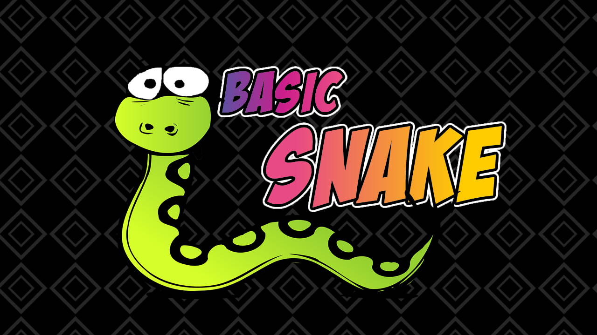

# Snake (игра)

## Snake (Питон, Удав, Змейка и др.) 
 
### Компьютерная игра, впервые появившаяся в кнопочном телефоне Nokia 6110. 
### Разработана финским разработчиком Танели Арманто и выпущена компанией Nokia.

## Игровой процесс

Игрок управляет длинным, тонким существом, напоминающим змею, которое ползает по плоскости (как правило, ограниченной стенками),
собирая еду (или другие предметы), избегая столкновения с собственным хвостом и краями игрового поля. 
Каждый раз, когда змея съедает кусок пищи, она становится длиннее, что постепенно усложняет игру.'

## История

В 1995 году в компанию Nokia приходит работать Танели Арманто — программист из Финляндии с небольшим опытом в игровой индустрии. 
Он же получает задание придумать для телефона Nokia 6110 несколько простых игр, которые подходили бы по его мощности. 
Арманто же, в свою очередь, предлагает компании сделать всего лишь одну игру. 
Изначально Танели был уверен в своём варианте — тетрисе. Он уже успел его адаптировать и протестировать, как получил жесткое требование от компании Tetris[en] 
— с каждого проданного телефона она получает свою долю денег. 
Однако, в Nokia всех смутила фраза про «каждый проданный телефон», ведь они не собирались вести точный счет продаж. 
Окончательное решение находится, когда Арманто играет со своим другом на Apple Macintosh в игру, где каждый управляет своей змеей. 
Арманто ищет похожие игры и находит будущий первоисточник — игру Blockade 1976 года, от которой и пошли истоки «Змейки».

Танели позднее сам вспоминал о том, что изначальная версия игры была гораздо труднее конечного варианта: 
у него у самого не получалось стать чемпионом, и, как он сам считает, единственный способ прохождения — тренировки. 
Чтобы у игрока был шанс на спасение при врезании в стенку, он добавил несколько миллисекунд задержки.